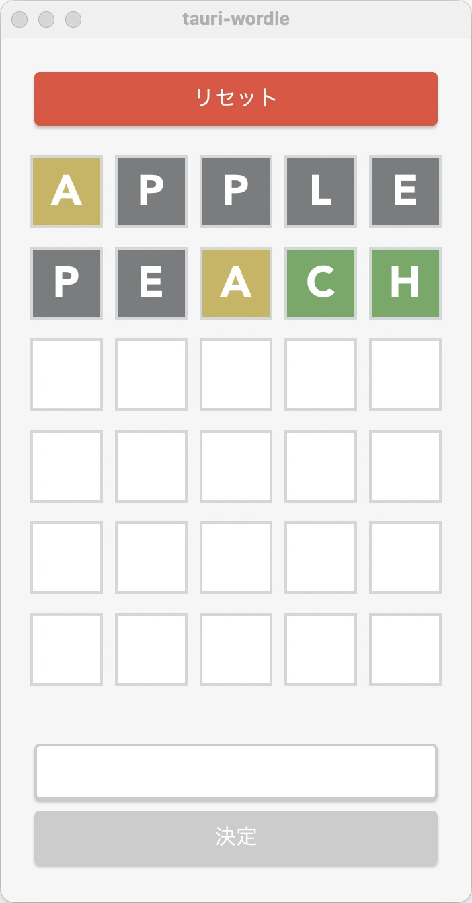

# tauri-wordle

<p align="center">

</p>

[wordle](https://www.nytimes.com/games/wordle/index.html)のTauriクローンです．

## 単語追加
`./src-tauri/resources/word_list.txt`を編集．

## 環境
- [Tauri 2.0](https://v2.tauri.app/ja/)
- Rust（rustc v1.85.1）
- Node.js（v23.10.0）

### 推奨IDE
- [VS Code](https://code.visualstudio.com/) + [Tauri](https://marketplace.visualstudio.com/items?itemName=tauri-apps.tauri-vscode) + [rust-analyzer](https://marketplace.visualstudio.com/items?itemName=rust-lang.rust-analyzer)

## 開発モード実行

```bash
yarn tauri dev
```

## ビルド
```bash
yarn tauri build
```